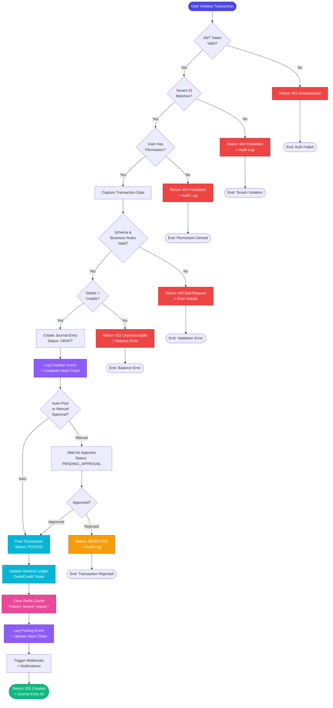

# Annex C-1 — System Process Flow

> BIR Annex C-1: Complete system process flow showing end-to-end transaction lifecycle with tenant isolation, validation, posting, and audit controls.

## Scope
- End-to-end transaction lifecycle: capture → validation → posting → reporting
- Tenant isolation and audit logging checkpoints
- Double-entry enforcement and cache invalidation
- Multi-level approval workflow and error handling

## System Process Flow Diagram

## Functional Description

### Transaction Lifecycle Stages

#### 1. Authentication & Authorization Layer

**JWT Token Validation (Gate 1)**
- Every API request must include valid JWT token in Authorization header
- Token verified using shared `JWT_SECRET` from environment variables
- Token expiry enforced (default: 24 hours, configurable via `JWT_EXPIRY`)
- Invalid tokens immediately rejected with 401 Unauthorized response

**Tenant Scope Validation (Gate 2)**
- JWT payload must contain `tenantId` matching the requested resource
- Prevents cross-tenant data access even with valid authentication
- Middleware (`validateTenantScope`) extracts and verifies tenant context
- Violations logged to `AuditLog` with severity: CRITICAL

**Permission Enforcement (Gate 3)**
- User's role checked against required permission for operation
- Example permissions: `create_journal_entry`, `approve_transactions`, `view_reports`
- Permission denied logged to audit trail with user ID and attempted action
- Fine-grained control per operation (create vs read vs update vs delete)

#### 2. Transaction Capture & Validation

**Schema Validation**
- Request body validated against Prisma schema definitions
- Required fields enforced: `journalNumber`, `entryDate`, `companyId`, `details[]`
- Data types validated: dates, decimals, UUIDs, enums
- Malformed requests rejected with detailed error messages

**Business Rules Validation**
- `journalNumber` must be unique within tenant scope
- `entryDate` cannot be in the future
- `companyId` must exist and belong to same tenant
- Each `JournalDetail` must reference valid `ChartOfAccount`
- Account codes must match account types (e.g., no debit to liability accounts)

**Double-Entry Enforcement**
- System calculates: `sum(details.debit) === sum(details.credit)`
- Unbalanced entries rejected with 422 Unprocessable Entity
- Error response includes calculated debit/credit totals and difference
- Prevents broken financial statements at data entry point

#### 3. Draft Creation & Audit Logging

**Journal Entry Creation**
- Initial status: `DRAFT` (allows corrections before posting)
- Transaction stored in `JournalEntry` table with metadata
- Related `JournalDetail` records created for each line item
- Database transaction ensures atomicity (all-or-nothing)

**First Audit Log Entry**
- `AuditLogger.log()` called with:
  - `entityType`: "JournalEntry"
  - `entityId`: newly created journal entry ID
  - `action`: "CREATE"
  - `changes`: null (no previous state)
  - `performedBy`: JWT user ID
- SHA-256 hash computed linking to previous audit entry
- Immutable record established in `AuditLog` table

#### 4. Approval Workflow (Optional)

**Manual Approval Branch**
- High-value transactions (e.g., > PHP 50,000) require approval
- Status changes: DRAFT → PENDING_APPROVAL
- Notification sent to users with `approve_transactions` permission
- Approver reviews transaction details and supporting documents

**Approval Decision**
- **Approved**: Proceeds to posting stage with approver audit trail
- **Rejected**: Status set to REJECTED, reason logged, notifies creator
- Approval history maintained with timestamps and approver IDs
- Rejected entries cannot be re-submitted (must create new entry)

**Auto-Post Branch**
- Low-value or routine transactions automatically posted
- Configured per company or transaction type
- Still generates full audit trail
- Reduces manual bottlenecks for high-frequency entries

#### 5. Transaction Posting

**General Ledger Update**
- For each `JournalDetail`:
  - Locate or create `GeneralLedger` record for `(chartOfAccountId, period)`
  - Increment `debitTotal` or `creditTotal` based on detail
  - Update account `balance` on `ChartOfAccount` table
- Period derived from `entryDate` (YYYY-MM format)
- Database transaction ensures consistency

**Status Transition**
- `JournalEntry.status` changed from DRAFT → POSTED
- `postedAt` timestamp recorded
- Posted entries become immutable (can only be VOIDED, never deleted)

**Cache Invalidation**
- Redis cache cleared for tenant-specific reports:
  - Pattern: `tenant:{tenantId}:report:*`
  - Ensures next Trial Balance/General Ledger fetch is fresh
  - Prevents stale financial data in cached reports
- Cache invalidation logged for debugging performance issues

**Second Audit Log Entry**
- `AuditLogger.log()` called with:
  - `action`: "POST"
  - `changes`: JSON object with status change from DRAFT to POSTED
  - `performedBy`: User or system (if auto-posted)
- Hash chain updated to maintain cryptographic integrity

#### 6. Post-Processing

**System Notifications**
- Webhook events fired for external integrations:
  - Event type: `journal_entry.posted`
  - Payload: entry ID, company, amount, accounts affected
- Internal notifications sent to stakeholders:
  - Accountant notified of high-value postings
  - CFO notified of GL balance changes exceeding threshold

**Report Generation Triggers**
- Scheduled jobs may regenerate cached reports asynchronously
- Trial Balance for affected period marked for refresh
- Variance reports triggered if balances exceed budget limits

### Error Handling & Remediation

**Validation Errors (4xx)**
- User-correctable issues returned with actionable error messages
- Example: "Account code '9999' does not exist for tenant"
- No side effects (no partial data saved)
- User can correct input and retry

**System Errors (5xx)**
- Database connection failures, Redis unavailable, etc.
- Transaction rolled back if mid-process
- Error logged with stack trace and context
- Alerting system notified for DevOps investigation
- User shown generic error message (no sensitive details exposed)

**Voiding Posted Transactions**
- Posted entries cannot be deleted (audit compliance)
- Reversal process:
  1. Create new journal entry with reversed debit/credit
  2. Link to original via `voidedByEntryId` reference
  3. Update original entry status: POSTED → VOIDED
  4. Audit log records both void action and reversal entry
- Maintains complete financial history and audit trail

### Controls & Checkpoints Summary

| Stage | Control Point | Evidence | Responsible Party |
|-------|---------------|----------|-------------------|
| Authentication | JWT validation | Token signature verification | API Middleware |
| Authorization | Tenant scope check | Audit log entry on violation | TenantScope middleware |
| Authorization | Permission check | RBAC matrix evaluation | requirePermission middleware |
| Validation | Schema compliance | Prisma validation errors | API Controller |
| Validation | Business rules | Custom validation logic | Service Layer |
| Validation | Double-entry balance | Debit/Credit sum comparison | FinancialService |
| Audit | Creation logged | AuditLog record with hash | AuditLogger |
| Approval | Manual review | Approval timestamp + user ID | Approver |
| Posting | GL consistency | Database transaction | FinancialService |
| Posting | Cache invalidation | Redis KEYS deletion | CacheService |
| Audit | Posting logged | AuditLog hash chain update | AuditLogger |
| Integrity | Tamper detection | SHA-256 hash verification | AuditLogger.detectTampering() |

### BIR Compliance Alignment

**Revenue Regulation 9-2009 Requirements**
- ✅ Immutable audit trail (no deletion of posted entries)
- ✅ Cryptographic integrity protection (SHA-256 hash chain)
- ✅ User attribution for every transaction (performedBy field)
- ✅ Timestamp accuracy (stored in UTC, converted for reports)
- ✅ Change history preservation (before/after snapshots in AuditLog)
- ✅ System-generated journal numbers (sequential, unique per tenant)

**Annex C-1 Specific Requirements**
- ✅ Process flow diagram (this document)
- ✅ Control points identified (see table above)
- ✅ Approval workflow documented (manual vs auto-post)
- ✅ Error handling procedures (validation, rollback, void)
- ✅ Audit trail integration (every stage logged)

### Performance Optimizations

**Redis Caching Strategy**
- Heavy reports (Trial Balance, General Ledger) cached with 24-hour TTL
- Cache keys prefixed with `tenant:{id}` for isolation
- Automatic invalidation on transaction posting
- Cache hit rate target: >90% for read-heavy reports

**Database Indexing**
- Composite index on `(tenantId, journalNumber)` for fast lookups
- Index on `(tenantId, status)` for pending approval queries
- Index on `(chartOfAccountId, period)` for GL aggregation
- Index on `(tenantId, previousHash)` for hash chain verification

**Async Processing**
- Webhook notifications sent via background job queue
- Large report generation delegated to worker processes
- Email notifications batched and sent off critical path
- Monitoring metrics updated asynchronously

---

## Diagram Interaction Points

1. **Start Node**: API endpoint receives POST request with transaction data
2. **Auth Gates (3 levels)**: Token → Tenant → Permission validation cascade
3. **Validation Diamond**: Schema + business rules + double-entry enforcement
4. **Draft Creation**: Atomic database transaction with audit log
5. **Approval Branch**: Conditional based on transaction value or type
6. **Posting Process**: GL update + cache clear + audit log update
7. **Success/Error Terminals**: HTTP response codes with appropriate payload

**Color Legend**:
- **Purple (Indigo)**: Start/Success states
- **Red**: Error/Rejection states
- **Orange**: Pending/Review states
- **Cyan**: Core processing steps
- **Pink**: Cache operations
- **Violet**: Audit logging events
