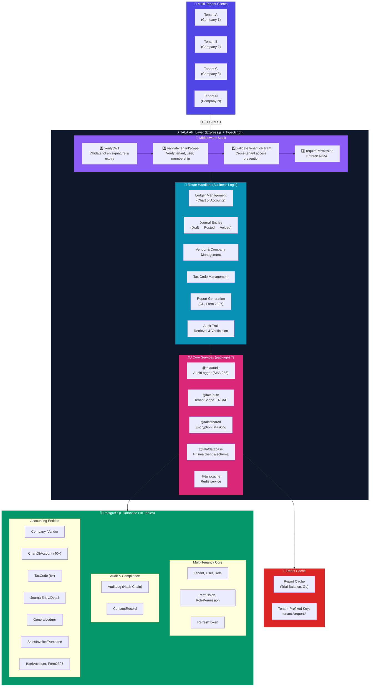
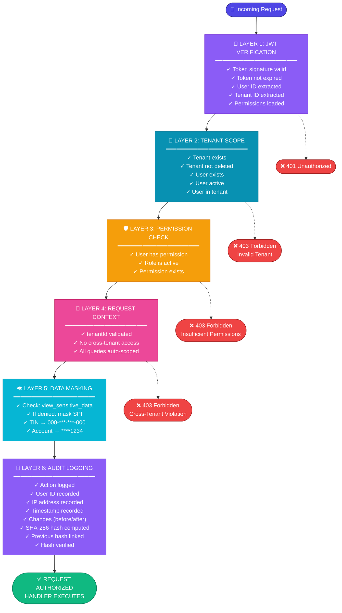

# TALA Architecture & Component Overview

## 🏗️ System Architecture Diagram



## Component Details

The Mermaid diagram above shows the complete system architecture. Key components include:

### API Layer Components

**Middleware Stack**:
- `verifyJWT` - Validates token signature and expiry
- `validateTenantScope` - Verifies tenant, user, and membership
- `validateTenantIdParam` - Prevents cross-tenant access
- `requirePermission` - Enforces RBAC

**Route Handlers**:
- Ledger Management (Chart of Accounts)
- Journal Entries (Draft → Posted → Voided)
- Vendor & Company Management
- Tax Code Management
- Report Generation (General Ledger, Form 2307)
- Audit Trail Retrieval & Verification

**Core Services**:
- `@tala/audit` - AuditLogger with SHA-256 hash chain
- `@tala/auth` - TenantScope middleware + RBAC
- `@tala/shared` - Encryption and masking utilities
- `@tala/database` - Prisma client & schema

### Database Structure

**PostgreSQL (18 Tables, Fully Normalized)**:

**Multi-Tenancy Core**:
- Tenant, User, Role
- Permission, RolePermission
- RefreshToken

**Audit & Compliance**:
- AuditLog (Hash Chain)
- ConsentRecord

**Accounting Entities**:
- Company, Vendor
- ChartOfAccount (40+ default accounts)
- TaxCode (6+ BIR codes)
- JournalEntry, JournalDetail
- GeneralLedger
- SalesInvoice, PurchaseInvoice
- BankAccount, Form2307

**Security Features**:
- Encryption: AES-256-CBC
- Indexing: Performance optimized
- Tenancy: tenantId on all tables

---

## 🔐 Security Layers Diagram



---

## 🔗 Cryptographic Audit Chain Diagram

```
Timeline of Journal Entry "JE-001" Actions:

┌─────────────────────────────────────────────────────────────────────┐
│ ACTION 1: CREATE                                      2024-01-15 10:00 │
├─────────────────────────────────────────────────────────────────────┤
│ previousHash:  NULL (initial)                                        │
│ dataHash:      SHA256(                                               │
│                  "" (null) +                                         │
│                  "JournalEntry" +                                    │
│                  "je-001" +                                          │
│                  "Created" +                                         │
│                  "2024-01-15T10:00:00Z" +                            │
│                  "user-123"                                          │
│                )                                                     │
│ Result:        "abc123def456ghi789..."                               │
│ hashVerified:  ✓ TRUE                                                │
│ Action:        Created (Draft)                                       │
│ User:          John Doe (user-123)                                   │
└─────────────────────────────────────────────────────────────────────┘
                            │
                            │ (IMMUTABLE)
                            ↓
┌─────────────────────────────────────────────────────────────────────┐
│ ACTION 2: POST                                        2024-01-15 11:30 │
├─────────────────────────────────────────────────────────────────────┤
│ previousHash:  "abc123def456ghi789..." ← LINKED TO ACTION 1         │
│ dataHash:      SHA256(                                               │
│                  "abc123def456ghi789..." +  ← Chain Link!            │
│                  "JournalEntry" +                                    │
│                  "je-001" +                                          │
│                  "Posted" +                                          │
│                  "2024-01-15T11:30:00Z" +                            │
│                  "user-456"                                          │
│                )                                                     │
│ Result:        "jkl012mno345pqr678..."                               │
│ hashVerified:  ✓ TRUE (matches computed hash)                        │
│ Action:        Posted to Ledger                                      │
│ User:          Jane Smith (user-456)                                 │
└─────────────────────────────────────────────────────────────────────┘
                            │
                            │ (IMMUTABLE)
                            ↓
┌─────────────────────────────────────────────────────────────────────┐
│ ACTION 3: VOID                                        2024-01-15 12:00 │
├─────────────────────────────────────────────────────────────────────┤
│ previousHash:  "jkl012mno345pqr678..." ← LINKED TO ACTION 2         │
│ dataHash:      SHA256(                                               │
│                  "jkl012mno345pqr678..." +  ← Chain Link!            │
│                  "JournalEntry" +                                    │
│                  "je-001" +                                          │
│                  "Voided" +                                          │
│                  "2024-01-15T12:00:00Z" +                            │
│                  "user-789"                                          │
│                )                                                     │
│ Result:        "stu901vwx234yza567..."                               │
│ hashVerified:  ✓ TRUE (matches computed hash)                        │
│ Action:        Voided (Data Entry Error)                             │
│ User:          Bob Manager (user-789)                                │
│ chainValid:    ✓ TRUE (All hashes valid, unbroken chain)            │
└─────────────────────────────────────────────────────────────────────┘

═════════════════════════════════════════════════════════════════════════

TAMPER SCENARIO: If someone tries to change ACTION 2 from "Posted" to "Deleted":

┌─────────────────────────────────────────────────────────────────────┐
│ ACTION 2 MODIFIED (TAMPERING DETECTED)                              │
├─────────────────────────────────────────────────────────────────────┤
│ previousHash:  "abc123def456ghi789..."                               │
│ dataHash:      SHA256(                                               │
│                  "abc123def456ghi789..." +                           │
│                  "JournalEntry" +                                    │
│                  "je-001" +                                          │
│                  "Deleted" ← CHANGED!                                │
│                  "2024-01-15T11:30:00Z" +                            │
│                  "user-456"                                          │
│                )                                                     │
│ Result:        "xxx999yyy000zzz111..." ← DIFFERENT!                 │
│ Stored Hash:   "jkl012mno345pqr678..."                               │
│                                                                      │
│ VERIFICATION: xxx999yyy000zzz111... ≠ jkl012mno345pqr678...        │
│ hashVerified:  ✗ FALSE ← TAMPERING DETECTED!                        │
│                                                                      │
│ IMPACT:                                                              │
│ • ACTION 3 also fails verification (chain broken)                    │
│ • chainValid: FALSE                                                  │
│ • Security alert triggered                                           │
│ • Admin notification sent                                            │
│ • Full history preserved for investigation                           │
└─────────────────────────────────────────────────────────────────────┘
```

---

## 📊 Database Schema Relationships

```
┌─────────────────────┐
│      TENANT         │ ← Root of Multi-Tenancy
│  ─────────────────  │
│ • id (PK)           │
│ • name              │
│ • industry          │
│ • timezone          │
└────────┬────────────┘
         │
    ┌────┴────┬────────────┬───────────┬───────────┐
    │          │            │           │           │
    ↓          ↓            ↓           ↓           ↓
 ┌──────┐  ┌──────┐  ┌──────────────┐ ┌─────────┐ ┌────────┐
 │ User │  │ Role │  │ Permission   │ │AuditLog │ │Company │
 │ (1)  │  │ (1)  │  │ (25+)        │ │ (chain) │ │ (many) │
 └──────┘  └──────┘  └──────────────┘ └─────────┘ └────────┘
    │          │           │
    │          └─────┬──────┘
    │                │
    │           RolePermission
    │           (M:M Junction)
    │
    ├──→ RefreshToken
    │
    └──→ Vendor (belongs to Company)
         │
         └──→ PurchaseInvoice
              └──→ ConsentRecord

ACCOUNTING CORE:
┌──────────────────┐      ┌─────────────┐
│ChartOfAccount(40)├◄─────┤JournalEntry │
│                  │      │ (Draft/Post)│
│ • accountCode    │      └──────┬──────┘
│ • accountType    │             │
│ • debitBalance   │             ├──→ JournalDetail ─┐
└──────────────────┘             │                   │
                                 │                   │
                    ┌────────────┴───────────────────┴──┐
                    │                                   │
                    ↓                                   ↓
             GeneralLedger                        TaxCode (6+)
        (Running Balances)                    (VAT, EWT, ATC)
                                                      │
                ┌──────────────────────┬──────────────┘
                │                      │
                ↓                      ↓
         SalesInvoice         PurchaseInvoice
            (Invoice)            (with EWT)
                                      │
                                      ├──→ Vendor
                                      │
                                      └──→ BankAccount
                                            (Encrypted)

COMPLIANCE:
┌──────────────┐
│ Form2307      │ ← Quarterly EWT Reporting
│ (Quarterly)   │
└──────────────┘

All with: tenantId, timestamps, soft deletes (deletedAt)
```

---

## 🎨 UI/UX Layer (Next.js + Tailwind)

```
┌────────────────────────────────────────────────────────────┐
│           TALA WEB APPLICATION (Next.js)                  │
├────────────────────────────────────────────────────────────┤
│                                                            │
│  ┌────────────────────────────────────────────────────┐  │
│  │  HEADER / NAVIGATION                              │  │
│  │  • Logo & Branding                                │  │
│  │  • User Profile Menu                              │  │
│  │  • Dark/Light Mode Toggle                         │  │
│  └────────────────────────────────────────────────────┘  │
│                                                            │
│  ┌────────────────────────────────────────────────────┐  │
│  │  SIDEBAR NAVIGATION                               │  │
│  │  • Dashboard                                       │  │
│  │  • Ledger & Journals                              │  │
│  │  • Invoicing (Sales/Purchase)                     │  │
│  │  • Reports                                        │  │
│  │  • Settings                                       │  │
│  └────────────────────────────────────────────────────┘  │
│                                                            │
│  ┌────────────────────────────────────────────────────┐  │
│  │              MAIN CONTENT AREA                      │  │
│  │                                                    │  │
│  │  ┌──────────────────────────────────────────────┐ │  │
│  │  │ Journal Entry Form                           │ │  │
│  │  │ ┌─────────────────────────────────────────┐  │ │  │
│  │  │ │ JE-2024-001                             │  │ │  │
│  │  │ │ Description: Monthly rent payment       │  │ │  │
│  │  │ │ Date: 2024-01-15                        │  │ │  │
│  │  │ │                                         │  │ │  │
│  │  │ │ ┌─────────┬──────────┬────────┬───────┐ │  │ │  │
│  │  │ │ │ Account │ Debit    │ Credit │ Tax   │ │  │ │  │
│  │  │ │ ├─────────┼──────────┼────────┼───────┤ │  │ │  │
│  │  │ │ │ 1000    │ 10,000   │        │ -     │ │  │ │  │
│  │  │ │ │ 2000    │          │ 10,000 │ -     │ │  │ │  │
│  │  │ │ ├─────────┼──────────┼────────┤───────┤ │  │ │  │
│  │  │ │ │ TOTAL   │ 10,000   │ 10,000 │BALANCED│ │  │ │  │
│  │  │ │ └─────────┴──────────┴────────┴───────┘ │  │ │  │
│  │  │ │                                         │  │ │  │
│  │  │ │ [Save as Draft] [Post] [Cancel]         │  │ │  │
│  │  │ │                                         │  │ │  │
│  │  │ │ ┌─────────────────────────────────────┐ │  │ │  │
│  │  │ │ │ [📋 View Audit Trail] ← Button      │ │  │ │  │
│  │  │ │ └─────────────────────────────────────┘ │  │ │  │
│  │  │ └─────────────────────────────────────────┘  │ │  │
│  │  └──────────────────────────────────────────────┘ │  │
│  │                                                    │  │
│  └────────────────────────────────────────────────────┘  │
│                                                            │
│                 ┌────────────────────────────────────────┐│
│                 │   AUDIT SIDEBAR (Slide-over)          ││
│                 ├────────────────────────────────────────┤│
│                 │ Audit Trail                     [X]    ││
│                 │ ─────────────────────────────────────  ││
│                 │ ✓ Chain: VERIFIED                      ││
│                 │ Entity: JournalEntry: je-001           ││
│                 │                                        ││
│                 │ Entry #1: CREATED                      ││
│                 │ John Doe • john@company.ph             ││
│                 │ 2024-01-15 10:00:00                    ││
│                 │ ✓ Hash OK                              ││
│                 │                                        ││
│                 │ Entry #2: POSTED                       ││
│                 │ Jane Smith • jane@company.ph           ││
│                 │ 2024-01-15 11:30:00                    ││
│                 │ status: draft → posted                 ││
│                 │ ✓ Hash OK                              ││
│                 │                                        ││
│                 │ Entry #3: VOIDED                       ││
│                 │ Bob Manager • bob@company.ph           ││
│                 │ 2024-01-15 12:00:00                    ││
│                 │ Reason: Data entry error               ││
│                 │ ✓ Hash OK                              ││
│                 │                                        ││
│                 │ [Refresh]                              ││
│                 └────────────────────────────────────────┘│
│                                                            │
└────────────────────────────────────────────────────────────┘

COLORS (Dark Mode shown):
┌─────────────────────────────────────────────────┐
│ Primary (Navy):     #5584c1 ██████              │
│ Secondary (Gold):   #ffb821 ██████              │
│ Tertiary (Green):   #2eb482 ██████              │
│ Danger (Red):       #ff3333 ██████              │
│ Success (Green):    #24ed79 ██████              │
│ Background (Dark):  #0f161e ██████              │
│ Text (Light):       #ffffff ██████              │
└─────────────────────────────────────────────────┘
```

---

## 📦 Deployment Architecture

```
┌─────────────────────────────────────────────────────────────┐
│           PRODUCTION DEPLOYMENT                            │
├─────────────────────────────────────────────────────────────┤
│                                                             │
│  ┌───────────────────────────────────────────────────────┐ │
│  │ FRONTEND LAYER                                        │ │
│  │ ─────────────────────────────────────────────────────│ │
│  │ • Vercel (Next.js Static/SSR)                        │ │
│  │ • CDN (Cloudflare)                                   │ │
│  │ • SSL/TLS Certificates                              │ │
│  │ • Environment: NODE_ENV=production                   │ │
│  └───────────┬───────────────────────────────────────────┘ │
│              │ HTTPS (API requests)                         │
│              ↓                                               │
│  ┌───────────────────────────────────────────────────────┐ │
│  │ API LAYER                                             │ │
│  │ ─────────────────────────────────────────────────────│ │
│  │ • Express.js (Node.js)                               │ │
│  │ • Railway / Render / AWS Lambda                      │ │
│  │ • Environment Variables (.env):                       │ │
│  │   - JWT_SECRET (strong)                              │ │
│  │   - ENCRYPTION_KEY (32 chars)                        │ │
│  │   - DATABASE_URL (connection)                        │ │
│  │   - NODE_ENV=production                              │ │
│  │ • Request Rate Limiting                              │ │
│  │ • CORS Configuration                                 │ │
│  │ • Security Headers (HSTS, CSP, etc.)                │ │
│  └───────────┬───────────────────────────────────────────┘ │
│              │ HTTPS (TLS/SSL)                              │
│              ↓                                               │
│  ┌───────────────────────────────────────────────────────┐ │
│  │ DATABASE LAYER                                        │ │
│  │ ─────────────────────────────────────────────────────│ │
│  │ • PostgreSQL 14+ (AWS RDS / DigitalOcean)           │ │
│  │ • Connection Pool (10-20 connections)                │ │
│  │ • Automated Backups                                  │ │
│  │ • SSL/TLS Database Connection                        │ │
│  │ • Encryption at Rest (if available)                 │ │
│  │ • Regular Integrity Checks (audit chain)            │ │
│  │                                                      │ │
│  │ MIGRATIONS:                                          │ │
│  │ • pnpm db:push (Prisma migrations)                   │ │
│  │ • Rollback procedure documented                      │ │
│  │ • Backup before each migration                       │ │
│  │                                                      │ │
│  │ SEEDING:                                             │ │
│  │ • pnpm db:seed (Initial tenant setup)                │ │
│  │ • Default roles, permissions, GL accounts            │ │
│  │ • BIR tax codes pre-configured                       │ │
│  └───────────────────────────────────────────────────────┘ │
│                                                             │
│  ┌───────────────────────────────────────────────────────┐ │
│  │ MONITORING & LOGGING                                  │ │
│  │ ─────────────────────────────────────────────────────│ │
│  │ • CloudWatch / DataDog (API logs)                    │ │
│  │ • Database Query Logs                                │ │
│  │ • Audit Trail (application)                          │ │
│  │ • Error Tracking (Sentry)                            │ │
│  │ • Performance Monitoring (APM)                       │ │
│  │ • Security Alerts:                                   │ │
│  │   - Audit chain tampering detected                   │ │
│  │   - Cross-tenant access attempts                     │ │
│  │   - Unauthorized permission access                   │ │
│  └───────────────────────────────────────────────────────┘ │
│                                                             │
└─────────────────────────────────────────────────────────────┘
```

---

## ✨ TALA: Excellence in Accounting

```
    ╔═══════════════════════════════════════════════════════╗
    ║                                                       ║
    ║     🏛️  T A L A  🏛️                                  ║
    ║   Tax and Ledger Assistant                           ║
    ║                                                       ║
    ║   Philippine Computerized Accounting System          ║
    ║   Enterprise-Grade • Compliance-First • Secure       ║
    ║                                                       ║
    ║   ✅ Multi-Tenant Isolation                          ║
    ║   ✅ Cryptographic Audit Chain                       ║
    ║   ✅ RBAC with 25+ Permissions                       ║
    ║   ✅ Data Privacy & Encryption                       ║
    ║   ✅ Double-Entry Accounting                         ║
    ║   ✅ BIR Compliance Ready                            ║
    ║   ✅ Professional Dark/Light Theme                   ║
    ║                                                       ║
    ║   Built: January 14, 2026                            ║
    ║   Status: Production Ready                           ║
    ║                                                       ║
    ╚═══════════════════════════════════════════════════════╝
```

---

**TALA: Your Computerized Accounting System for Philippine Business Success**
