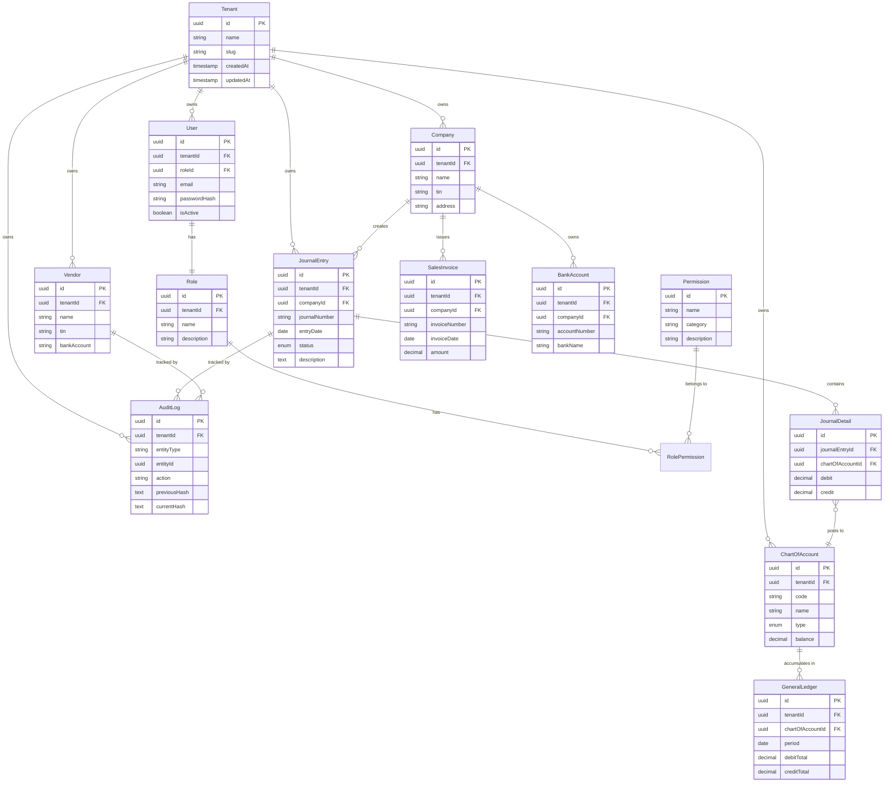

# Entity-Relationship Diagram (ERD) — Tenant Isolation

> Visual representation of TALA's multi-tenant database architecture showing complete tenant isolation.

## ERD: Tenant-Scoped Data Model

## Functional Description

### Multi-Tenant Isolation Architecture

**Tenant Entity (Root of Isolation)**
- Every tenant represents a completely isolated organization in the system
- Serves as the root foreign key constraint for all tenant-scoped data
- Ensures zero data leakage between different organizations
- Each tenant has unique slug identifier for API routing and subdomain isolation

**Access Control Layer (RBAC)**
- **User → Role (1:1)**: Each user is assigned exactly one role per tenant
- **Role ↔ Permission (M:M)**: Roles have multiple granular permissions via `RolePermission` junction table
- **Permission Categories**: Financial operations, reporting, admin, audit, sensitive data access
- **Default Roles**: Super Admin, Company Admin, Accountant, Clerk, Auditor (see seed data)

**Company & Vendor Management**
- **Company**: Represents the tenant's own business entities (can have multiple branches/divisions)
- **Vendor**: External suppliers/partners with encrypted sensitive data (TIN, bank accounts)
- Both entities fully scoped to `tenantId` with data masking based on user permissions

**Chart of Accounts (GL Structure)**
- Each tenant maintains their own chart of accounts
- Account codes can be customized per tenant (no cross-tenant conflicts)
- Pre-seeded with 40+ Philippine BIR-compliant GL accounts
- Supports Assets, Liabilities, Equity, Revenue, Expenses account types

**Double-Entry Journal System**
- **JournalEntry**: Header-level transaction with metadata (date, status, company)
- **JournalDetail**: Line items enforcing double-entry (sum of debits = sum of credits)
- **Status Workflow**: Draft → Posted → Voided (immutable audit trail)
- Each detail line posts to a specific `ChartOfAccount`

**General Ledger Aggregation**
- Automatically accumulates balances per account per period
- Enables fast Trial Balance and Financial Statement generation
- Cached via Redis with tenant-prefixed keys: `tenant:{id}:report:*`

**Cryptographic Audit Chain**
- **AuditLog**: Immutable log of all create/update/delete operations
- **Hash Chain**: Each entry contains SHA-256 hash linking to previous entry
- **Tampering Detection**: Any modification breaks the chain and triggers alerts
- Fully compliant with Philippine Revenue Regulation 9-2009

**Tenant-Scoped Constraints Summary**
- ✅ Every table with business data has `tenantId` foreign key
- ✅ Middleware validates JWT token contains matching `tenantId`
- ✅ All Prisma queries automatically filter by `req.user.tenantId`
- ✅ Cross-tenant access attempts logged and rejected with 403
- ✅ Database-level foreign key constraints enforce referential integrity

### Security & Compliance Features

1. **Data Encryption**: Sensitive fields (TIN, bank accounts) encrypted at rest using AES-256-CBC
2. **Data Masking**: Users without `view_sensitive_data` permission see masked values only
3. **Audit Trail**: Every financial transaction logged with before/after snapshots
4. **Consent Management**: User T&C and Privacy Policy acceptance tracked per `ConsentRecord`
5. **BIR Compliance**: Form 2307, tax codes, RR 9-2009 audit requirements built-in

### Key Database Indexes (Performance)

- `tenantId` indexed on all tenant-scoped tables
- Composite index on `(tenantId, entityType, entityId)` for audit queries
- Composite index on `(tenantId, code)` for Chart of Accounts lookups
- Composite index on `(tenantId, journalNumber)` for journal entry searches
- Hash chain integrity verified via indexed `previousHash` lookups

---

**Diagram Legend**:
- **One-to-many**: `||--o{` (crow's foot)
- **Many-to-one**: `}o--||` (crow's foot)
- **One-to-one**: `||--||` (single line)
- **PK**: Primary Key
- **FK**: Foreign Key (enforces tenant isolation)
