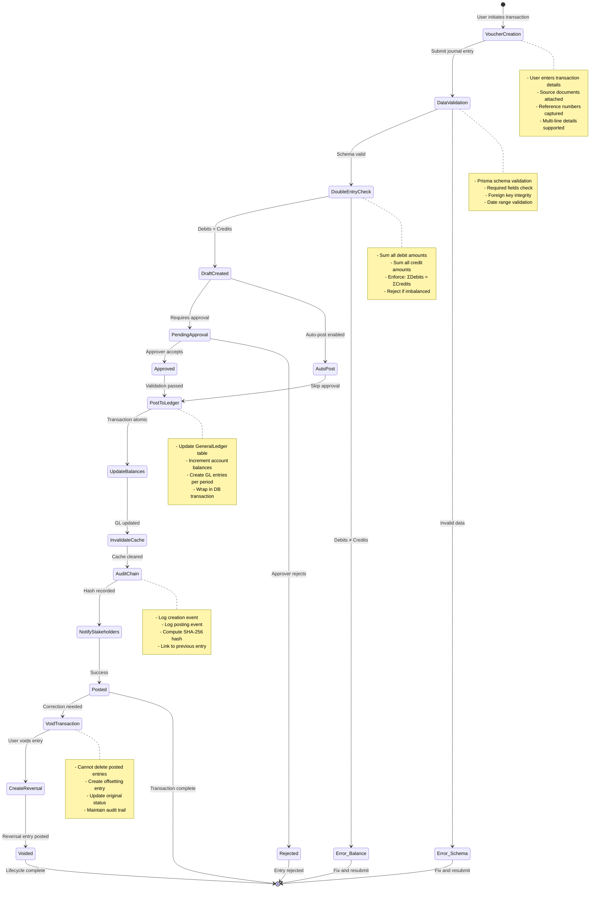
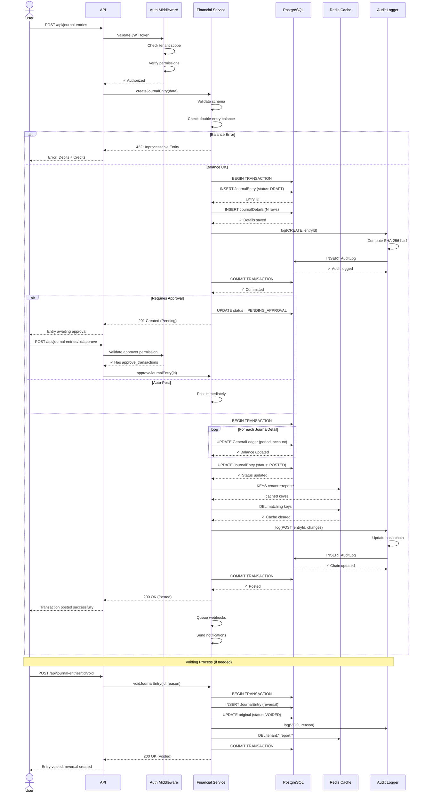

# Double-Entry Transaction Lifecycle

> Complete lifecycle of a financial transaction from voucher creation through posting to the general ledger, demonstrating double-entry bookkeeping principles and system controls.

## Transaction Lifecycle Diagram



## Alternative View: Sequence Diagram



## Functional Description

### Transaction Lifecycle Phases

#### Phase 1: Voucher Creation & Capture

**User Entry Interface**
- Multi-line journal entry form supporting unlimited detail lines
- Each line specifies: Account Code, Debit Amount, Credit Amount, Description
- Attachment support for source documents (receipts, invoices, contracts)
- Reference field for cross-linking to external systems or documents

**Data Collection**
- `journalNumber`: Auto-generated or manually entered (unique per tenant)
- `entryDate`: Transaction effective date (cannot exceed current date)
- `companyId`: Which company entity within tenant is transacting
- `description`: Narrative explaining the business purpose
- `details[]`: Array of line items with accounts and amounts

**Source Document Requirements**
- Supporting evidence attached for audit compliance
- Document metadata captured: filename, upload timestamp, file size
- Documents stored encrypted with access control per user role
- BIR requires 5-10 year retention depending on document type

#### Phase 2: Data Validation

**Schema-Level Validation (Prisma)**
- Data types enforced: UUIDs, Decimals (precision 18, scale 2), Dates, Enums
- Required fields validated: cannot proceed with null/undefined values
- String length limits: `journalNumber` (50 chars), `description` (500 chars)
- Foreign key constraints: `companyId`, `chartOfAccountId` must exist

**Business Rule Validation (Service Layer)**
- `journalNumber` uniqueness check within tenant scope
- `entryDate` range check (not in future, not before company inception)
- `chartOfAccountId` verification (account exists and active)
- Account type compatibility (e.g., cannot debit a contra account incorrectly)
- Minimum line item requirement (at least 2 lines for double-entry)

**User Feedback**
- Validation errors returned with field-level detail
- HTTP 400 Bad Request with JSON error array
- Example: `{"field": "details[0].debit", "error": "Must be positive number"}`
- Front-end displays errors inline next to form fields

#### Phase 3: Double-Entry Enforcement

**Balance Calculation**
```javascript
const totalDebits = details.reduce((sum, d) => sum + d.debit, 0);
const totalCredits = details.reduce((sum, d) => sum + d.credit, 0);

if (Math.abs(totalDebits - totalCredits) > 0.01) { // Allow 1 cent rounding
  throw new BalanceError(`Debits: ${totalDebits}, Credits: ${totalCredits}`);
}
```

**Enforcement Rules**
- Every debit must have a corresponding credit (and vice versa)
- Total debit amounts must equal total credit amounts (sum equality)
- Rounding tolerance: 0.01 PHP (1 centavo) to handle decimal precision
- System prevents saving imbalanced entries (cannot proceed to DRAFT)

**Error Handling**
- HTTP 422 Unprocessable Entity returned for imbalanced entries
- Response includes calculated totals and difference amount
- User must correct amounts to balance before resubmission
- Prevents broken financial statements at source

#### Phase 4: Draft Status & Review

**Draft Creation**
- Entry saved with `status: DRAFT` in `JournalEntry` table
- All detail lines inserted into `JournalDetail` table
- Database transaction ensures atomicity (all-or-nothing)
- Draft entries do not affect General Ledger balances yet

**Draft Benefits**
- Allows user to save work-in-progress without committing
- Can be edited/updated before posting (flexibility)
- Enables collaborative review by multiple users
- Supports batch entry workflows (create many, review, post all)

**Audit Trail Begins**
- First audit log entry created with action: "CREATE"
- Captures full entry details as JSON snapshot
- Records user ID of creator (`performedBy` field)
- Initiates SHA-256 hash chain linking to previous audit entry

#### Phase 5: Approval Workflow (Conditional)

**Approval Triggers**
- Transaction amount exceeds threshold (e.g., PHP 50,000)
- Specific account codes require approval (e.g., cash disbursements)
- User role requires supervisor review (e.g., Clerk entries)
- Month-end closing transactions (additional scrutiny)

**Approval Process**
- Status updated: DRAFT → PENDING_APPROVAL
- Notification sent to users with `approve_transactions` permission
- Approver reviews entry details, supporting documents, business purpose
- Approver can:
  - **Approve**: Proceeds to posting (status → POSTED)
  - **Reject**: Entry marked REJECTED, reason recorded, creator notified
  - **Request Changes**: Entry returned to creator with comments

**Approval Audit Trail**
- Approval timestamp recorded in `approvedAt` field
- Approver user ID captured in `approvedBy` field
- Approval decision logged in audit chain with reason
- Rejected entries cannot be re-submitted (must create new entry)

**Auto-Post Branch**
- Low-risk transactions bypass manual approval
- Examples: recurring entries, automated imports, routine accruals
- Still generates full audit trail (no reduction in compliance)
- Configured per company or account code in settings

#### Phase 6: Posting to General Ledger

**General Ledger Update Logic**
```javascript
for (const detail of journalDetails) {
  const period = formatPeriod(journalEntry.entryDate); // "YYYY-MM"
  
  // Upsert GeneralLedger record
  await prisma.generalLedger.upsert({
    where: { chartOfAccountId_period: { chartOfAccountId: detail.accountId, period } },
    update: {
      debitTotal: { increment: detail.debit },
      creditTotal: { increment: detail.credit }
    },
    create: {
      chartOfAccountId: detail.accountId,
      period,
      debitTotal: detail.debit,
      creditTotal: detail.credit
    }
  });
  
  // Update account running balance
  await prisma.chartOfAccount.update({
    where: { id: detail.accountId },
    data: {
      balance: {
        increment: (detail.debit - detail.credit) // Net effect
      }
    }
  });
}
```

**Transaction Guarantees**
- All GL updates wrapped in single database transaction
- If any update fails, entire posting rolls back
- Prevents partial postings that would break financial integrity
- ACID properties maintained (Atomicity, Consistency, Isolation, Durability)

**Status Transition**
- `JournalEntry.status` updated: DRAFT → POSTED
- `postedAt` timestamp recorded (UTC timezone)
- `postedBy` user ID captured (even for auto-posts)
- Posted entries become immutable (can only be voided)

#### Phase 7: Cache Invalidation

**Redis Cache Strategy**
- Heavy reports cached with keys: `tenant:{id}:report:{name}:{context}`
- Examples:
  - `tenant:org-1:report:trial_balance:2024-01`
  - `tenant:org-1:report:general_ledger:1000:2024-01`
- TTL: 24 hours (86400 seconds)

**Invalidation on Posting**
```javascript
const pattern = `tenant:${tenantId}:report:*`;
const keys = await redis.keys(pattern);
if (keys.length > 0) {
  await redis.del(...keys);
}
```

**Why Invalidate?**
- Newly posted entry affects Trial Balance totals
- General Ledger balances now stale in cache
- Next report request will fetch fresh data from database
- Subsequent requests will be cached again (cache-aside pattern)

**Performance Impact**
- First request after posting: slower (2-5 seconds, DB query)
- Subsequent requests: fast (50-150ms, cache hit)
- Cache hit rate typically >90% in production
- Acceptable trade-off for data consistency

#### Phase 8: Audit Chain Update

**Second Audit Log Entry**
- Action: "POST" (or "APPROVE_AND_POST" if from approval)
- Changes captured:
  ```json
  {
    "status": { "from": "DRAFT", "to": "POSTED" },
    "postedAt": "2026-01-14T10:30:00.000Z",
    "postedBy": "uuid-of-user"
  }
  ```
- SHA-256 hash computed linking to previous audit entry
- Hash chain verification ensures no tampering with audit history

**Hash Computation**
```javascript
const dataToHash = JSON.stringify({
  tenantId,
  entityType: "JournalEntry",
  entityId: journalEntry.id,
  action: "POST",
  changes,
  performedBy: userId,
  performedAt: timestamp,
  previousHash: lastAuditEntry.currentHash
});

const currentHash = crypto.createHash('sha256').update(dataToHash).digest('hex');
```

**Tamper Detection**
- Periodic job runs `AuditLogger.detectTampering()`
- Recalculates all hashes and compares to stored values
- Any mismatch indicates data modification attempt
- Alerts sent to security team for investigation

#### Phase 9: Post-Processing & Notifications

**Webhook Events**
- Event type: `journal_entry.posted`
- Payload: entry ID, company, total amount, accounts affected, timestamp
- Subscribers: external systems (ERP, BI tools, compliance platforms)
- Delivery guaranteed via retry queue (at-least-once semantics)

**Internal Notifications**
- Email to accountant for high-value postings (>PHP 100,000)
- Dashboard alert for CFO if monthly budget threshold exceeded
- Slack notification to finance channel for unusual account activity
- SMS alert for critical account movements (cash, payroll)

**Report Triggers**
- Variance reports scheduled to regenerate if budget vs actual changes
- Cash flow projections updated asynchronously
- Tax liability estimates recalculated for quarterly reporting
- Trial Balance report queued for regeneration (pre-cache for next user)

### Voiding Posted Transactions

**Why Void Instead of Delete?**
- BIR compliance requires immutable audit trail
- Deletion violates Revenue Regulation 9-2009
- Voiding maintains complete transaction history
- Enables auditors to see original and correction entries

**Void Process**
1. User initiates void with reason code and explanation
2. System verifies user has `void_transactions` permission
3. New journal entry created with reversed debit/credit amounts
4. Reversal entry linked to original via `voidedByEntryId` field
5. Original entry status updated: POSTED → VOIDED
6. Audit log records void action with reason and reversal ID
7. Cache invalidated (same as posting)
8. Notifications sent to stakeholders

**Reversal Entry Example**
- Original: Debit Cash $100, Credit Revenue $100
- Reversal: Debit Revenue $100, Credit Cash $100
- Net effect: Balances restored to pre-transaction state
- Both entries remain visible in General Ledger with VOIDED flag

### Integration Points

**Upstream Systems**
- Sales module → Journal entry for revenue recognition
- Purchasing module → Journal entry for expense accrual
- Payroll module → Journal entry for salary expense and withholdings
- Treasury module → Journal entry for bank transfers and reconciliations

**Downstream Systems**
- BI/Reporting platform subscribes to `journal_entry.posted` webhook
- Tax compliance system receives entries for BIR forms generation
- Budget monitoring system checks actuals vs budget on posting
- Document management system links source documents to entries

**Data Flow**
```
Source System → API Gateway → Auth Middleware → Financial Service
                                                         ↓
                                            ← Database ← Prisma ORM
                                                         ↓
                                            Audit Logger ← Hash Chain
                                                         ↓
                                            Cache Service ← Redis
                                                         ↓
                                            Notification Service ← Queue
```

### Performance Metrics

**Target SLAs**
- Entry creation (draft): 500ms or less (p95)
- Entry posting: 2s or less (p95)
- Cache invalidation: 100ms or less (p99)
- Audit log write: 200ms or less (p95)
- Webhook delivery: Under 5s (p99, with retries)

**Monitoring**
- Transaction throughput: entries posted per minute
- Error rate: % of entries failing validation
- Cache hit rate: % of report requests served from cache
- Approval queue depth: entries awaiting review
- Hash chain integrity: daily verification job status

---

## Key Takeaways

1. **Double-Entry Integrity**: System enforces debits = credits at every stage
2. **Immutable Audit Trail**: Posted entries cannot be deleted, only voided
3. **Multi-Level Validation**: Schema → Business Rules → Double-Entry balance
4. **Cryptographic Security**: SHA-256 hash chain prevents tampering
5. **Tenant Isolation**: All operations scoped to single tenant ID
6. **Cache Consistency**: Automatic invalidation ensures fresh financial data
7. **Approval Workflow**: Configurable based on amount, account, or user role
8. **BIR Compliance**: Aligns with Philippine Revenue Regulation 9-2009
9. **Performance Optimized**: Redis caching for heavy reports (Trial Balance, GL)
10. **Error Recovery**: Void-and-reverse pattern maintains complete history

